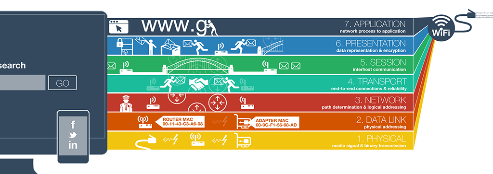

# Networking Basics

## OSI Model

### What it is

The OSI (Open Systems Interconnection) Model is a conceptual framework used to understand how data travels across a network.

### How many layers it has

It has 7 layers.

### How it is organized

Each layer has a specific role, and data moves down (sending) or up (receiving) through these layers.

## LAN (Local Area Network)

A LAN is a network that connects devices in a limited area.

### Typical usage

- Home networks
- Offices
- Schools
- Small buildings

### Typical geographical size

- A few meters up to a few kilometers
- Usually within a single building or campus

### MAC adress (Media Access Control address)

Unique hardware identifier assigned to a network interface card (NIC) by the manufacturer.

It operates at the Data Link layer (Layer 2) of the OSI model.

It is usually written as 6 groups of hexadecimal numbers:

- 00:1A:2B:3C:4D:5E
- or 00-1A-2B-3C-4D-5E
## WAN (Wide Area Network)

A WAN is a network that connects multiple LANs over large distances.

### Typical usage

- Internet service providers
- Corporate networks across cities/countries
- The Internet itself is the largest WAN

### Typical geographical size

- Hundreds to thousands of kilometers
- Can span countries or continents

## The Internet

Global system of interconnected WANs and LANs that communicate using the TCP/IP protocol suite.

## IP Address

An IP address is a unique identifier assigned to a device on a network to allow communication.

### Types of IP Addresses

- IPv4 – e.g. 192.168.1.1
- IPv6 – e.g. 2001:0db8::1

### Localhost

Localhost refers to the current machine you are using.

- IP address: 127.0.0.1 (IPv4)
- Used for testing and development

### Subnet

A subnet is a smaller network created from a larger network to improve performance and organization.

- Helps divide networks into logical groups
- Defined using a subnet mask (e.g. 255.255.255.0)

### Why IPv6 was created

Because IPv4 addresses were running out. It provides:

- A much larger address space
- Better routing efficiency
- Improved security features

## TCP / UDP

### Main transport protocols (OSI Layer 4)

- TCP (Transmission Control Protocol)
- UDP (User Datagram Protocol)

### Main difference between TCP and UDP

- TCP
  - Reliable
  - Connection-based
  - Ensures data arrives in order
  - Slower
- UDP
  - Faster
  - No guarantee of delivery
  - No ordering
  - Used for real-time applications

## Port

A port is a logical endpoint used to identify a specific service on a device.

- Web server = port 80 or 443
- SSH= port 22

### Common port numbers

- SSH: 22
- HTTP: 80
- HTTPS: 443

### Network connectivity check tool

The most commonly used tool is:

- ping (ping google.com)

It checks if a device is reachable over a network using ICMP (Internet Control Message Protocol).
